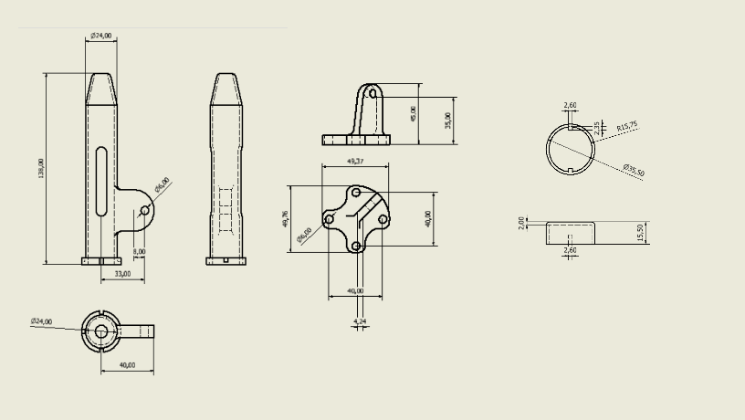
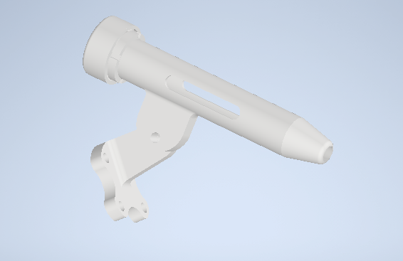
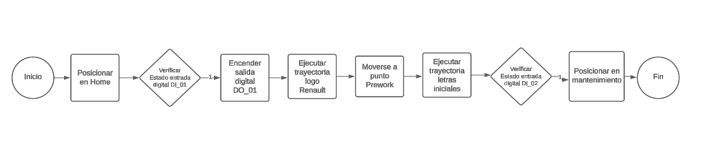
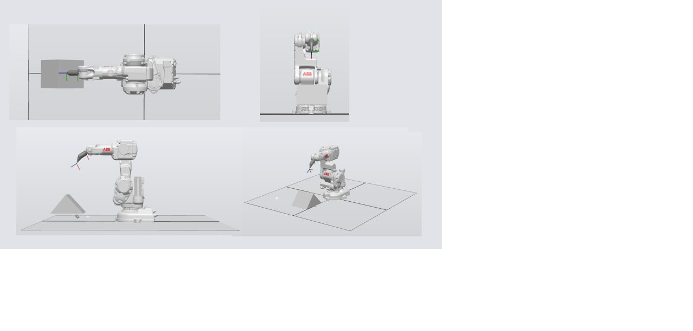
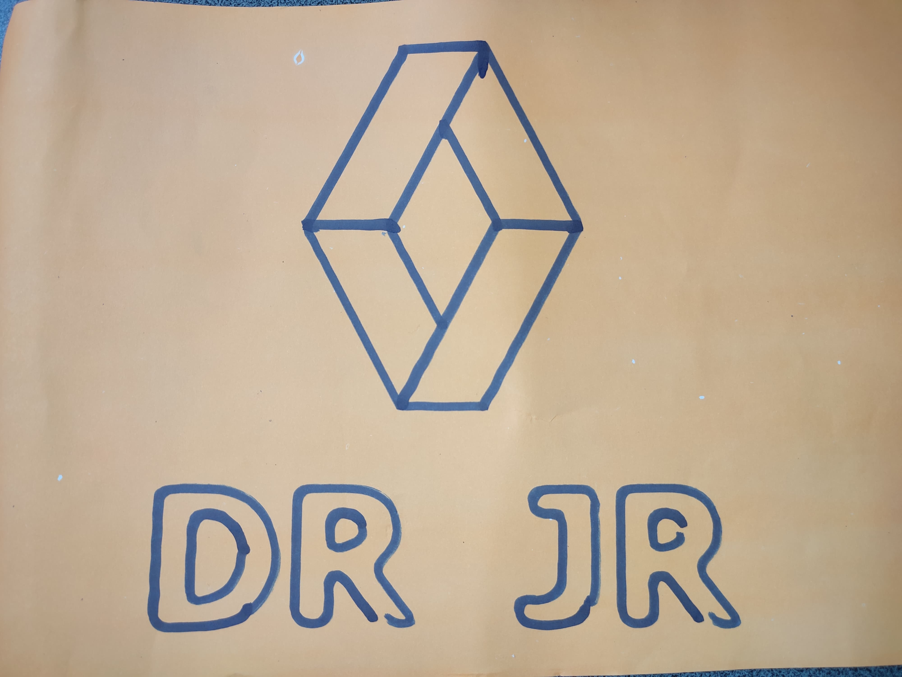

# Laboratorio 1 de Robótica: Dibujo del Logo de Renault e Iniciales en un Tablero inclinado

- David Andrés Ricaurte de Lima  
  *Ingeniería Mecatrónica*  
  *Universidad Nacional de Colombia*  
  Bogotá, Colombia  
  dricaurte@unal.edu.co

- Juan Antonio Rojas Cobos
  *Ingeniería Mecatrónica*  
  *Universidad Nacional de Colombia*  
  Bogotá, Colombia  
  juarojasco@unal.edu.co


Este proyecto tiene como objetivo programar un robot ABB IRB 140 para dibujar el logo de Renault y las iniciales de los miembros del grupo en un tablero colocado en un plano inclinado. A continuación, se detalla la solución implementada.

## Descripción de la Solución Planteada

El robot ABB IRB 140 ha sido programado para moverse de manera precisa sobre el tablero inclinado, siguiendo un conjunto de instrucciones predefinidas para dibujar el logo de Renault y las iniciales. Para esto, primero se hizo el diseño de la herramienta que contiene el marcador, se modeló el workobject, y se definieron las orientaciones y trayectorias.

## Diseño de la Herramienta

La herramienta de dibujo ha sido diseñada para adaptarse al extremo del robot ABB IRB 140 y permitir trazos precisos sobre el tablero. Se ha tenido en cuenta la estabilidad y la precisión en el diseño de la herramienta para garantizar resultados óptimos en el dibujo, además de dotarla con un sistema de retroceso que permite que la punta del marcador pueda retroceder cuando la presiona el robot, por medio de un resorte interno.
Se diseñaron las piezas que comprende el ensamblaje, base, cilindro y tapa, que tienen el mecanismo de cierre facil para montar el marcador:





La herramienta se elaboró por medio de impresión 3D, a partir del modelo diseñado. Los archivos utilizados para la impresión 3D, se encuentran disponlibles en:
[Modelo 3D herramienta](https://www.thingiverse.com/thing:6537971)

## Diagrama de Flujo de Acciones del Robot

El diagrama de flujo de acciones del robot muestra la secuencia de movimientos y acciones ejecutadas por el robot para completar la tarea de dibujo. Este diagrama proporciona una visión general de la lógica de programación utilizada para controlar el robot.



## Plano de Planta

El plano de planta muestra la disposición física de cada elemento en el entorno de trabajo, incluidos el robot, el workobject y la herramienta.



## Descripción de las Funciones Utilizadas

Se han utilizado diversas funciones en el código para controlar los movimientos del robot, gestionar la inclinación del plano y garantizar la precisión del dibujo. Estas funciones incluyen movimientos lineales y rotacionales, así como comandos para controlar la herramienta de dibujo.

Estas son las funcioes utilizadas:
```
        WaitDI DI_01,1 : Espera que la entrada DI_01 tenga un valor de uno para permitir que el codigo continue (Espera que se presione el boton).
        SetDO DO_01,1  : Setea el valor de la salida DO_01 en un valor de 1 (Enciende LED).
        HomeToPrework  : Mueve el robot desde la posición inicial hasta una posición previa al inicio de la rutina.
        Renault : Mueve el robot por la trayectoria que describe el logo.
        ToPreworkDR : Devuelve a el robot a una posición de descanso previa a continuar la rutina.
        Dint : Mueve el robot a lo largo de la trayectoria que describe la linea interior de la "D".
        Dext : Mueve el robot a lo largo de la trayectoria que describe la linea exterior de la "D".
        R1int : Mueve el robot a lo largo de la trayectoria que describe la linea interior de la "R".
        R1ext : Mueve el robot a lo largo de la trayectoria que describe la linea exterior de la "R".
        J : Mueve el robot a lo largo de la trayectoria que describe la linea de la "J".
        R2int : Mueve el robot a lo largo de la trayectoria que describe la linea interior de la segunda "R".
        R2ext : Mueve el robot a lo largo de la trayectoria que describe la linea exterior de la segunda "R".
        WaitDI DI_02,1 : Espera que la entrada DI_02 este en 1 para continuar la rutina (Espera que se presione el segundo boton).
        SetDO DO_01,0 : Setea el valor de la salida D0_01 en 0 (Apaga el LED).
        ToHome : Envia el robot a la posición de mantenimiento.

```
## Código en RAPID

El módulo utilizado para el desarrollo de la práctica se encuentra implementado en RAPID, el lenguaje de programación utilizado en los robots ABB. Este código controla todas las acciones del robot, desde los movimientos hasta el control de la herramienta de dibujo.

[Enlace al Código en RAPID](https://github.com/dricaurte29/LAB1_Robotica-2024-1/blob/1e6cc3599e96ed0de572da09085f5021eb06aef4/Module1.mod)

## Vídeo de Simulación en RobotStudio y Implementación en Robots Reales

Se proporciona un vídeo que muestra la simulación del proyecto en RobotStudio, así como la implementación de la práctica con el robot real. Este vídeo ofrece una demostración visual del funcionamiento del proyecto y los resultados obtenidos.

[Video Simulación](https://youtu.be/9bTxt7U3JFU)
[Video Implementación](https://youtu.be/6jf_3rTcXpg)

Resultado del dibujo:




